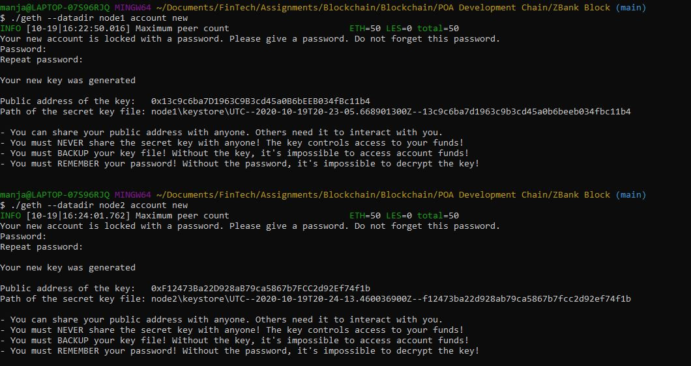
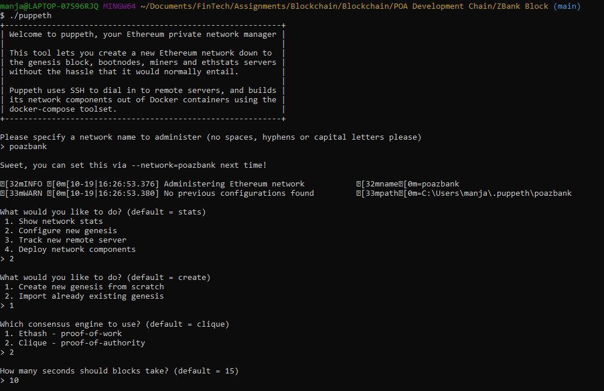
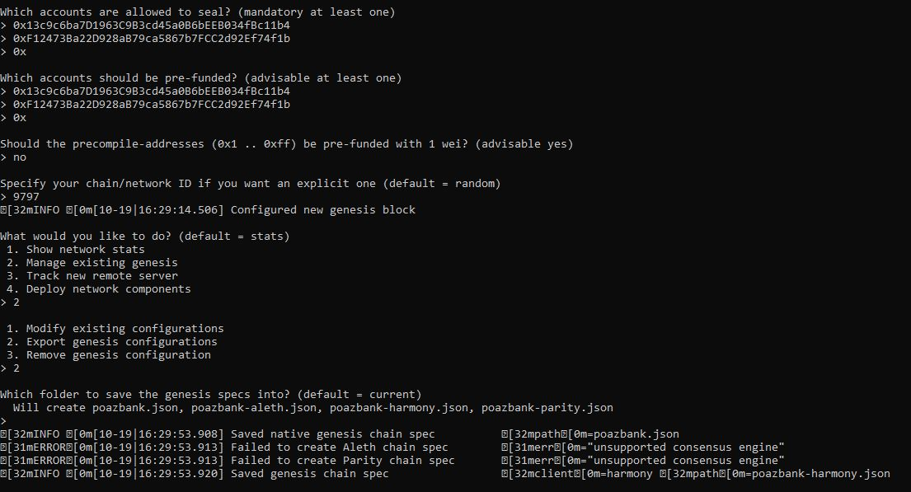
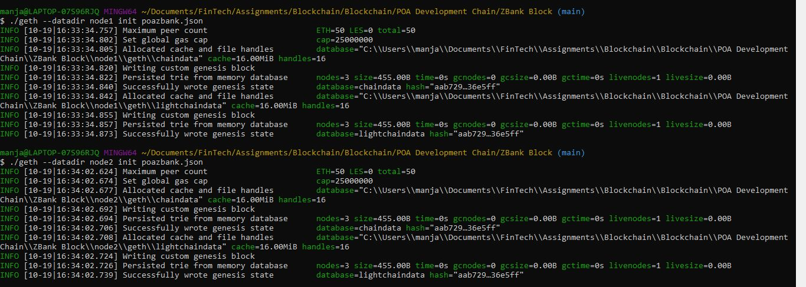
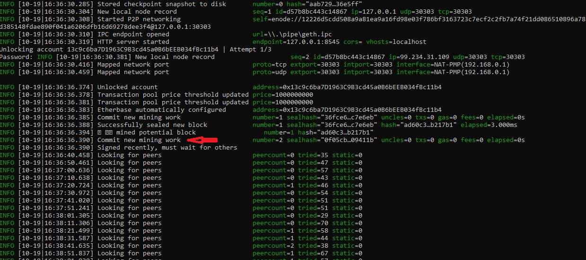
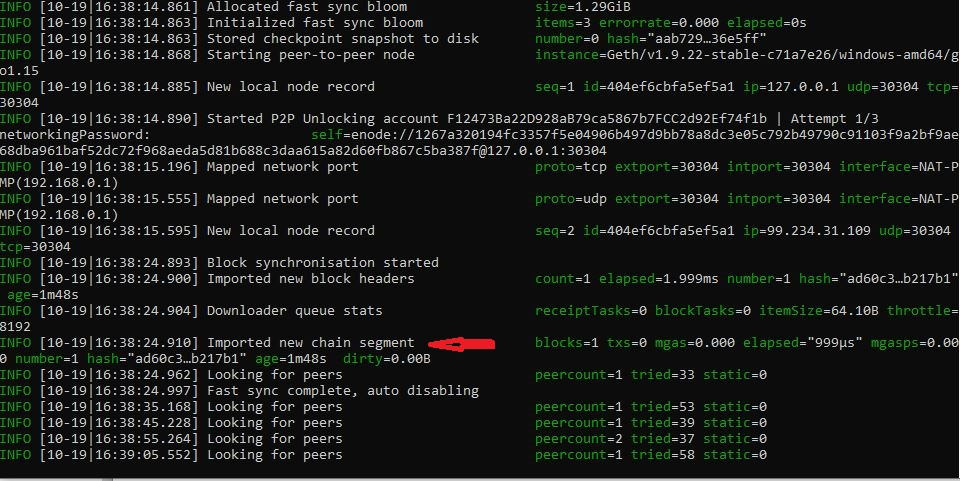
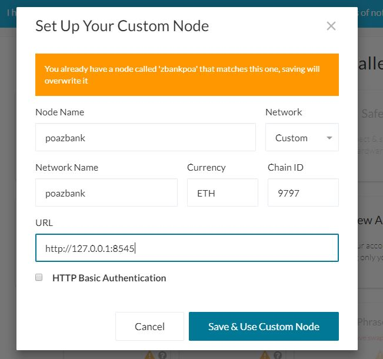
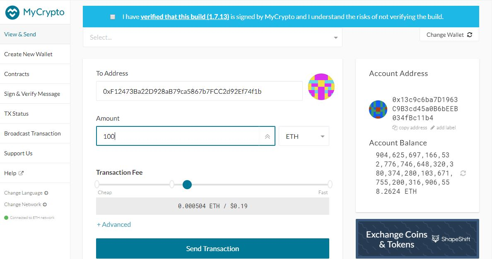
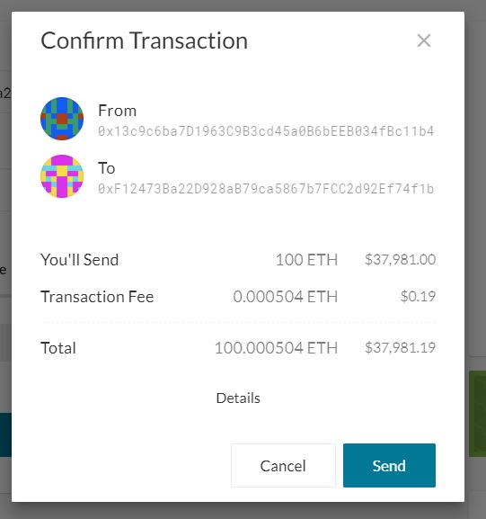
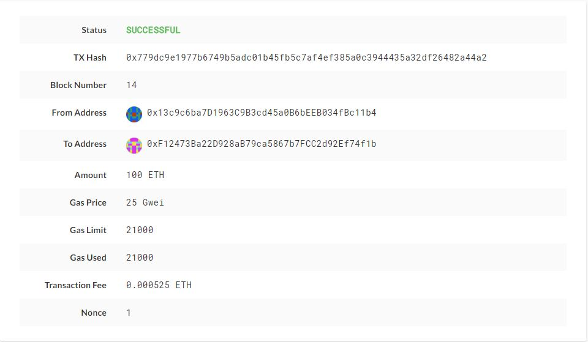

# ZBank Proof of Authority Development Chain

The Proof of Authority (PoA) algorithm is typically used for private blockchain networks as it requires pre-approval/voting of, the account addresses that can approve transactions (seal blocks).

Following are the instructions for setting up the testnet, running it and sending a test transaction. 

## Download Go Ethereum Tools

[Go Ethereum](https://geth.ethereum.org/) is one of the three original implementations of the Ethereum protocol. We will use Go Ethereum Tools to create our blockchain.

- Open your browser and navigate to the Go Ethereum Tools download page at https://geth.ethereum.org/downloads/

- Scroll down to the "Stable Releases" section and proceed to download the latest build available depending on your operating system.

- After downloading the tools archive, open your "Downloads" folder, and decompress the zip file and save it as `Zbank Block` folder.

## Creating Nodes

We will generate two new nodes with new account addresses because the accounts must be approved and that these will serve as our pre-approved sealer addresses.

`Geth`, a command-line tool is used to create accounts.

Two nodes for the network are created with a separate datadir for each using Geth. Following are the commands to generate the two nodes:

./geth --datadir node1 account new

./geth --datadir node2 account new

The password assigned to both nodes was `monk99`.

## Creating a Genesis Block

A genesis block is created using `puppeth`, a tool bundled with the Go Ethereum tool.

- Open a terminal window through `Git Bash` navigate to `ZBank Block` folder.

- Type `./puppeth`. 

- At the puppeth prompt type in the name of the network `poazbank`.

- Choose `2`  and then `1` to configure a new genesis block.

- Type `2` to choose the `The Clique- proof of authority` concensus algorithm.

- Paste both node 1 & node2 account addresses(public address of the key) from the first step, one at a time into the list of accounts to seal.

- Paste them again in the list of accounts to pre-fund. There are no block rewards in PoA, so you'll need to pre-fund.

- You can choose `no` for pre-funding the pre-compiled accounts (0x1 .. 0xff) with wei. This keeps the genesis cleaner.

- Specify the chain ID as `9797`.

A new genesis block is configured!

- Choose "Manage existing genesis" option from the main menu.

- Export genesis configurations. This will fail to create two of the files, but we will only need `poazbank.json`.

## Initializing and Running the nodes

With the genesis block creation complete, we will now initialize the nodes with the genesis' json file.

Using geth, initialize each node with the json file of the new network using the following commands:

./geth --datadir node1 init poazbank.json

./geth --datadir node2 init poazbank.json

Now the nodes can be used to begin mining blocks.

Run the nodes in separate Git Bash windows with the following commands:

Node 1

./geth --datadir node1 --unlock "13c9c6ba7D1963C9B3cd45a0B6bEEB034fBc11b4" --mine --rpc --allow-insecure-unlock

Node 2

./geth --datadir node2 --unlock "F12473Ba22D928aB79ca5867b7FCC2d92Ef74f1b" --mine --port 30304 --bootnodes "enode://12226d5cdd508a9a81ea9a16fd98e03f786bf3163723c7ecf2c2fb7a74f21dd086510896a782449e3ec46eacd385148fdae890f041a6206dfb16d69278dee3f4@127.0.0.1:30303" --ipcdisable --allow-insecure-unlock

NOTE: Type the password and hit enter - even if you can't see it visually!

Key details of the chain are recorded [here](Resources/key_info.txt).

The private PoA blockchain should now be running!

## Sending a Test Transaction

With both nodes up and running, the blockchain can be added to MyCrypto for testing.

* Open the MyCrypto app, then click Change Network at the bottom left.

* Click "Add Custom Node", then add the custom network information that was set in the genesis.

* Create a custom network, and include the chain ID '9797`, and use ETH as the currency. In the URL box type: http://127.0.0.1:8545. This points to the default RPC port on your local machine.

* After connecting to the custom network in MyCrypto, select the View & Send option from the left menu pane, then click Keystore file. 

* Select Wallet File and import the keystore file from the `node1/keystore` directory in ZBank Block folder into MyCrypto. This will import the private key and use the passcode `monk99`. This will open the account wallet in MyCrypto.

* We can now see the balance that was pre-funded for this account in the genesis configuration. The millions of ETH tokens are just  test tokens.

* Send a transaction from the `node1` account to the `node2` account by typing the address from node2 and send any amount of ETH.

* Click the Check TX Status when the green message pops up, confirm the logout and check transaction. 

* The transaction was successful!

